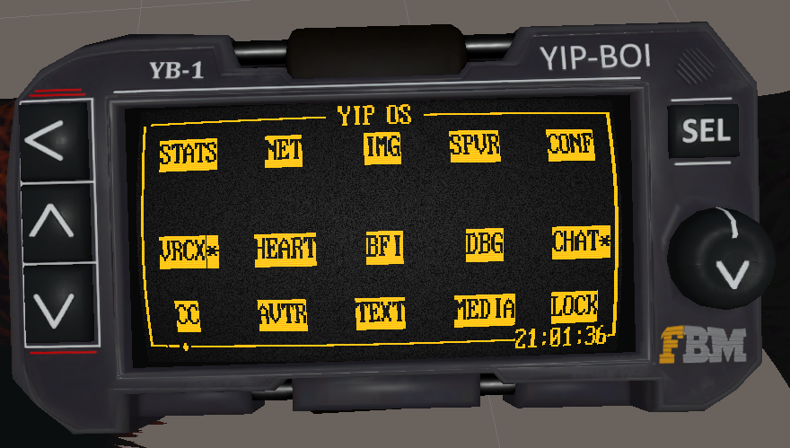
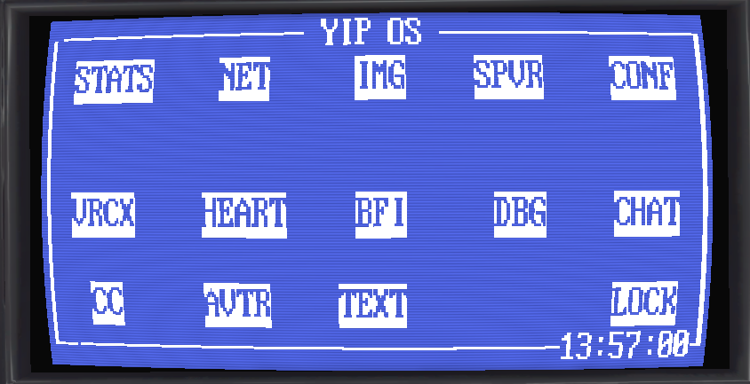
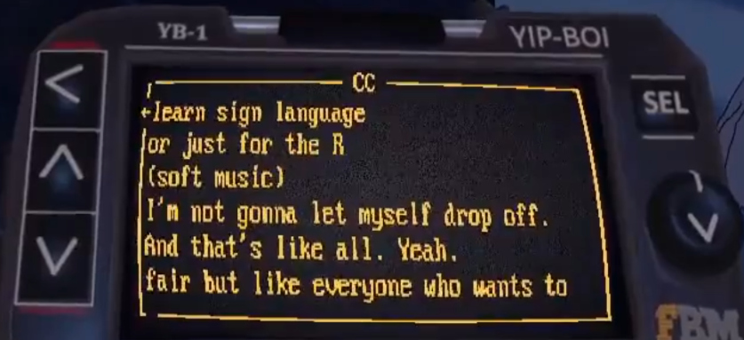
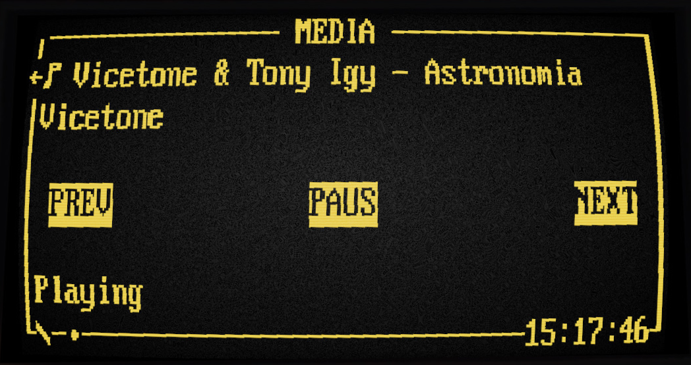
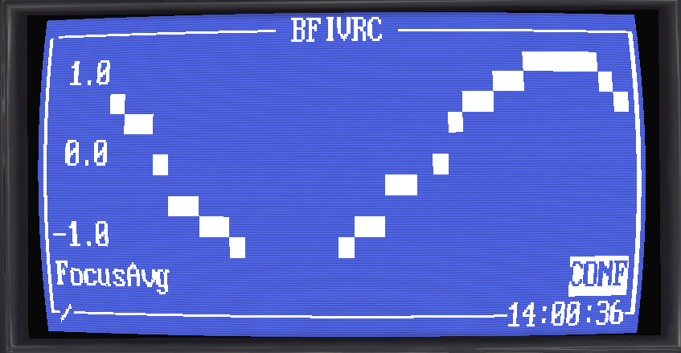
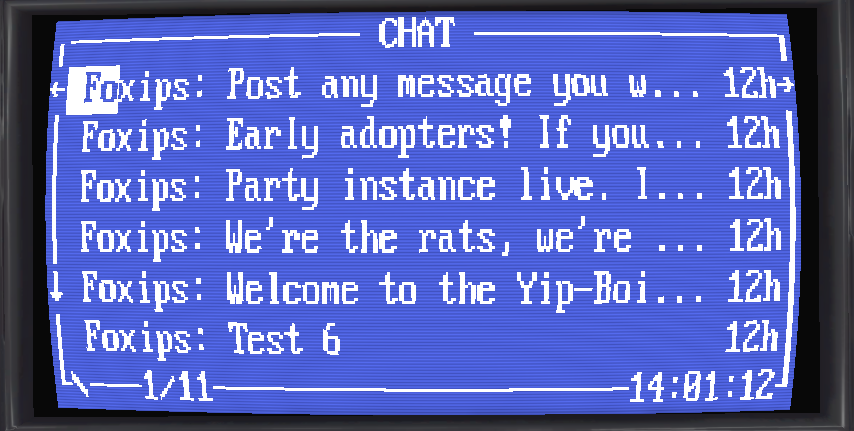
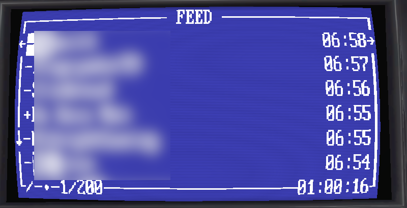

- [Yip OS](#yip-os)
  - [What Is It?](#what-is-it)
  - [How It Works](#how-it-works)
  - [Features](#features)
  - [Programs](#programs)
  - [Quickstart](#quickstart)
  - [Building From Source](#building-from-source)
  - [Safety and Privacy](#safety-and-privacy)
  - [Version History](#version-history)
  - [License](#license)
  - [Support](#support)

# Yip OS



**Yip OS** is a free and open-source desktop companion application that drives the **Yip-Boi**, a wrist-mounted CRT personal data assistant for VRChat. It renders real, live data from your computer onto a monochrome display strapped to your arm--visible to you and everyone around you in-world--and allows you and your friends to interact with an unlimited quantity (not predetermined at upload time) of bona fide programs.

The Yip-Boi is designed to be worn around your left arm. It features a **CRT screen** (green, amber, white, blue--you can customize it like crazy) which renders data in beautiful monochrome, a **touchscreen interface**, an **expandable 4K graphical ROM**, a **256-character font set**, and even beeps with a **PC speaker**. It straps to your arm using a blendshape-equipped, possibly sustainably sourced leather band that won't pinch and tug at your fur.

This isn't an overlay or a private HUD. The display is visible to other players in-world, with real synced data.

**Compatible avatar prefab:**

Gumroad: **[foxipso.gumroad.com](https://foxipso.gumroad.com/)**

Jinxxy: **[jinxxy.com/foxipso](https://jinxxy.com/foxipso)**

Purchasing the Yip-Boi avatar prefab supports the development of my assets and comes with the Unity asset that integrates Yip OS.

## What Is It?

Yip OS is a C++ application with a Dear ImGui interface that communicates with VRChat over OSC to drive the Yip-Boi's display and custom shader. It handles all the rendering logic, input processing, system monitoring, and program execution. The desktop companion application runs on both **Windows** and **Linux**.

Anyone capable of writing code--or brow-beating an AI into doing it for you--can extend Yip OS, run a custom version, make their own programs, and submit pull requests.

## How It Works

At the heart of the Yip-Boi is a contraption called a **Williams Tube**: a VRChat camera and glyph-based write head inspired by the [real historical device](https://en.wikipedia.org/wiki/Williams_tube), one of the earliest examples of RAM storage and retrieval.

When you're in a VRChat world, Yip OS continually sends OSC control commands to an invisible camera and write head floating near your avatar. The commands rapidly render font glyphs and graphics from a ROM stored as textures in a custom shader. The persistent render texture accumulates these writes like phosphor traces on a real CRT.

The display operates in **text mode**: a 40-column by 8-row character grid. The index of each character is individually transmitted from your computer into VRChat over OSC. Full-screen backgrounds are stamped in a single write cycle using pre-rendered **macro glyphs**, then only dynamic content (values, graphs, clocks, text) needs individual character writes--reducing screen transitions from 22 seconds to under 4.

None of the logical operation of the device actually happens in an animation controller. The animation controller simply responds to OSC commands that move the write head around, scale it, and toggle between drawing modes and font glyphs to render.

## Features

- **CRT display** with realistic shader (scanlines, phosphor persistence, bloom, jitter -- all configurable)
- **Touchscreen interface** with a 5x3 grid of touch zones and five physical buttons
- **Six touch points** on the display surface, activated by tapping your index finger claw-tip (FingerIndexR, FingerIndexL)
- **256-glyph Character ROM** with box-drawing, icons, and inverted variants for UI elements
- **Macro glyph atlas** for quick full-screen rendering
- **NVRAM** for persistent settings between power cycles
- **Autolock** to prevent accidental inputs
- **PC speaker** beep on input (customizable or mutable)
- **OSCQuery** for automatic service discovery--no manual port configuration needed
- **100+ page** period-accurate [operator's manual](yip_os/docs/latex/manual.pdf)

## Programs

Yip OS comes with a home screen filled with programs that are designed to be useful, fun, or enjoyable to use in VRChat and fit within the constraints of VR interaction and OSC render speed.

| Program | Description |
|---------|-------------|
| **STATS** | CPU, GPU, memory, network, disk usage, temperatures, and uptime |
| **NET** | Real-time network utilization with oscilloscope-style sweep graph |
| **HEART** | Heartbeat monitor and BPM trend graph via OSC |
| **SPVR** | [StayPutVR](https://github.com/InconsolableCellist/StayPutVR) integration--lock/unlock tracked devices from your wrist |
| **CONF** | System configuration (boot speed, write delay, debounce, autolock, etc.) |
| **VRCX** | Read-only VRCX database integration--friend activity, world history, notifications |
| **CC** | Live closed captions (mic or system audio) via local Whisper AI transcription (no audio sent externally) |
| **AVTR** | Avatar switching and toggle control via OSC |
| **IMG** | Bitmap image display--renders arbitrary images character-by-character |
| **TEXT** | Arbitrary text display, with optional VRChat ChatBox input |
| **MEDIA** | Now-playing display with playback controls |
| **BFI** | BrainFlow EEG parameter graphing (via ChilloutCharles' [BFiVRC](https://github.com/ChilloutCharles/BrainflowsIntoVRChat)) |
| **CHAT** | Live Telegram group chat for Yip-Boi owners (read in-game, post using your existing device)|
| **TWTCH** | Live Twitch chat viewer (anonymous IRC, no account required) |
| **STONK** | Stock and crypto ticker with configurable watchlist |
| **INTRP** | Live interpreter -- local Whisper transcription + CTranslate2/NLLB translation (CPU or CUDA) |
| **DM** | Peer-to-peer direct messages, QR-paired in VRChat via camera capture |
| **LOCK** | Screen lock -- tap SEL three times to unlock |

<table>
<tr>
<td><br><sub>HOME</sub></td>
<td><br><sub>STATS</sub></td>
<td><br><sub>NET</sub></td>
<td><br><sub>HEART</sub></td>
</tr>
<tr>
<td><br><sub>SPVR</sub></td>
<td><br><sub>CONF</sub></td>
<td><br><sub>VRCX</sub></td>
<td><br><sub>CC</sub></td>
</tr>
<tr>
<td><br><sub>AVTR</sub></td>
<td><br><sub>IMG</sub></td>
<td><br><sub>MEDIA</sub></td>
<td><br><sub>BFI</sub></td>
</tr>
<tr>
<td><br><sub>CHAT</sub></td>
<td><br><sub>VRCX Feed</sub></td>
<td><br><sub>VRCX Worlds</sub></td>
<td><br><sub>CC Config</sub></td>
</tr>
</table>

## Quickstart

You need a compatible avatar. You can use the Yip-Boi avatar prefab, available on [Gumroad](https://foxipso.gumroad.com/) and [Jinxxy](https://jinxxy.com/foxipso).

1. Import the `.unitypackage` into your Unity project
2. Drag the **Yip-Boi** prefab onto your avatar
3. Position and scale `Yip-Boi->Container` as desired
4. Upload your avatar to VRChat
5. Enable OSC in VRChat: Action Menu -> Options -> OSC -> Enabled
6. Launch the Yip OS desktop companion application on your PC
7. VRChat will discover Yip OS via OSCQuery and establish a connection
8. The PDA display will begin rendering

> **Note:** The Williams Tube rendering method requires **28 bits of parameter space**. This is fairly heavy for an asset, and you may want to make a version of your avatar that sacrifices some of your other heavy assets.

For testing in Unity without uploading, see the [Operator's Manual](yip_os/docs/latex/manual.pdf) on Play Mode testing with the included OSC scripts.

## Building From Source

### Prerequisites
- C++17 compiler (GCC, Clang, or MSVC)
- CMake 3.15 or higher
- Dependencies are fetched automatically via CMake (GLFW, Dear ImGui, whisper.cpp, etc.)

### Windows
```bash
cd yip_os
cmake -B build
cmake --build build --config Release
```

### Linux
Requires development packages for OpenGL, libcurl, PulseAudio, and Vulkan:
```bash
# Fedora/RHEL
sudo dnf install mesa-libGL-devel libcurl-devel pulseaudio-libs-devel vulkan-headers vulkan-loader-devel glslc

# Ubuntu/Debian
sudo apt install libgl-dev libcurl4-openssl-dev libpulse-dev libvulkan-dev glslc
```
```bash
cd yip_os
cmake -B build
cmake --build build
```

### Asset Pipeline (Python)
The font atlas and macro glyph atlas are generated with Python scripts:
```bash
python3 generate_pda_rom.py         # 256-glyph text atlas
python3 generate_macro_atlas.py     # Pre-rendered screen backgrounds
```
Requires Python 3, Pillow, and python-osc.

## Safety and Privacy

Depending on what features you enable, this device will display and allow interaction with your real, actual, potentially personal information to other users in VRChat. Avatar names, toggles, friend list, etc.

Depending on your interaction settings, other users may also be able to interact with the device -- they could cycle through your friends in VRCX, go through your list of recent avatars and make you change, or toggle things on and off on your avatar.

To combat this, **VRCX, AVTR, CHAT, TWTCH, INTRP, and DM are disabled by default** and require you to manually enable them in the Yip OS desktop app with your actual mouse and keyboard.

## Version History

**1.1.3** - Build-time git hash, DM pairing audio cues (PulseAudio/PlaySound), DM pair screen macros, full QR self-heal refresh, shader normal guard for multi-avatar scenes, mDNS listen thread fix, manual refresh

**1.1.2** - DM polish: compose screen (CC speech-to-text), session diagnostics/log tab, version+hash on boot screen, self-notification fix, QR refresh stability, macro stamps for all pair modes

**1.1.1** - Windows feature parity (MeCab Japanese kanji→hiragana), CPU-only CTranslate2 build, three-installer pipeline, HEART OSC parameter docs, OSCQuery disable toggle, avatar CTRL parameter filter, Whisper bracketed-text stripping

**1.1.0** - TWTCH Twitch chat viewer, INTRP live interpreter (Whisper + NLLB translation, CUDA support), STONK stock/crypto ticker, DM private messages (QR pairing via VRChat camera capture, Cloudflare Worker backend), extended character ROM (Bank 1, double-resolution atlases), MeCab integration, thread-safety refactor, ListScreen base class, UIManager split into per-tab files

**1.0.0** - Initial release

## Technical Specifications

| Property | Value |
|----------|-------|
| Render Texture | 512x512 R8G8B8A8_UNORM |
| Macro Atlas | 4096x4096 R Compressed BC4 UNorm |
| Text Grid | 40 columns x 8 rows |
| Character ROM | 256 glyphs (16x16 atlas) |
| Synced Parameters | 28 bits |
| Write Speed | ~70ms per glyph |
| Screen Transition | ~2-4 seconds (macro stamp + dynamic content) |

## License

This project is licensed under the Apache 2.0 License. See [LICENSE](LICENSE) for details.
